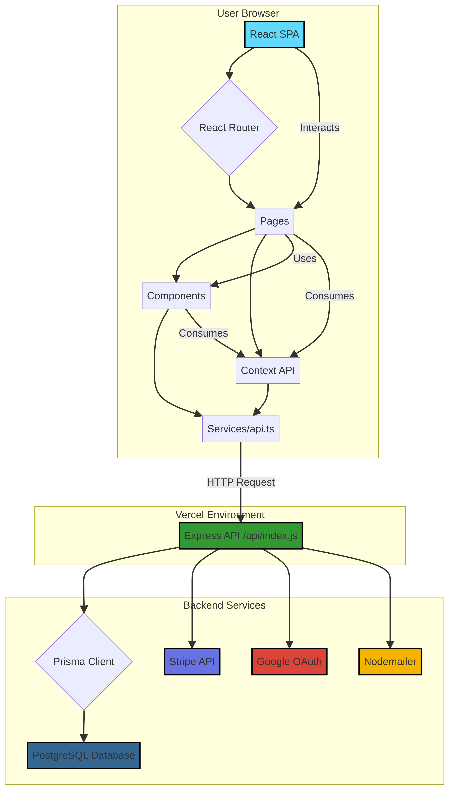

# Comprehensive Analysis of the Himalaya Vitality eCommerce Platform

**Author**: Manus AI
**Date**: January 26, 2026

## 1. Introduction

This document provides a deep-dive analysis of the **Himalaya Vitality** GitHub repository. The project is a premium, single-product eCommerce platform designed for performance, global sales, and a high-conversion user experience. The analysis covers the full technology stack, application architecture, core functionalities, key data flows, and deployment strategy. The primary goal is to understand the complete working logic of the application, from the user interface to the database.

## 2. Project Overview

Himalaya Vitality is a modern, full-stack web application built to market and sell a single core product, "Pure Himalayan Shilajit Resin," with several bundle options. It features a customer-facing storefront and a comprehensive administrative dashboard for managing the business.

### Key Features

- **Single-Product Focus**: The entire user experience is optimized to showcase and sell one main product in different package sizes (bundles).
- **Global Commerce Ready**: Includes multi-currency support with automatic IP-based currency detection and dynamic shipping calculations.
- **Conversion-Optimized Checkout**: A streamlined, one-page checkout process integrated with Stripe for secure payments.
- **Comprehensive Admin Dashboard**: An internal portal for managing orders, product inventory, customer reviews, and discount codes.
- **Authentication**: Secure user accounts with email/password and Google OAuth, including email verification.
- **SEO and Analytics**: Built with Search Engine Optimization (SEO) best practices and integrated with Google Analytics & Meta Pixel for tracking user behavior.

## 3. Technology Stack

The application leverages a modern, JavaScript-based technology stack, balancing a rich frontend experience with a scalable serverless backend.

| Category             | Technology / Library                                    |
| -------------------- | ------------------------------------------------------- |
| **Frontend**         | React 18, Vite, TypeScript, TailwindCSS                 |
| **Backend**          | Node.js with Express.js                                 |
| **Database**         | PostgreSQL                                              |
| **ORM**              | Prisma                                                  |
| **State Management** | React Context API (`useAuth`, `useCart`, `useCurrency`) |
| **Routing**          | React Router (HashRouter)                               |
| **Data Fetching**    | TanStack Query (React Query)                            |
| **Payments**         | Stripe (Payment Intents API)                            |
| **Authentication**   | JWT, bcrypt.js, Google OAuth                            |
| **Form Handling**    | React Hook Form with Zod for validation                 |
| **UI Components**    | Lucide React (Icons), Recharts (Charts)                 |
| **Deployment**       | Vercel                                                  |

## 4. Application Architecture

The application is architected as a **React Single-Page Application (SPA)** that communicates with a **serverless Node.js/Express backend API**. This hybrid approach allows for a fast, interactive frontend and a scalable, on-demand backend.

### Architecture Diagram

The following diagram illustrates the high-level architecture and data flow between the different components of the system.

### 4.1. Frontend Architecture

The frontend is built with React and TypeScript, structured into several key directories:

-   **/components**: Contains reusable UI elements like `Button`, `Card`, `Layout` (Navbar, Footer), and specialized components like `CartDrawer` and `AdminDashboard` widgets.
-   **/pages**: Each file corresponds to a specific route in the application (e.g., `HomePage.tsx`, `ProductPage.tsx`, `CheckoutPage.tsx`). These components assemble the UI from the smaller components.
-   **/context**: Manages global state using React's Context API. This is crucial for sharing data like authentication status (`AuthContext`), shopping cart contents (`CartContext`), and selected currency (`CurrencyContext`) across the entire application without prop-drilling.
-   **/services**: The `api.ts` file acts as a centralized data fetching layer. It abstracts all communication with the backend, providing strongly-typed functions (e.g., `fetchProduct`, `loginUser`) for the rest of the application to use. It also contains a mock adapter for development, allowing the frontend to be developed independently of the backend.
-   **/hooks**: While not a formal directory, the project extensively uses custom hooks like `useAuth`, `useCart`, and `useCurrency` to provide easy access to the global context.

### 4.2. Backend Architecture

The backend is a single Express.js application defined in `/api/index.js`. It is designed to be deployed as a serverless function on Vercel.

-   **API Routes**: The file defines all API endpoints, which are grouped by functionality (e.g., Auth, Orders, Products, Admin).
-   **Middleware**: An `authenticate` middleware function protects sensitive routes by verifying a JSON Web Token (JWT) sent in the `Authorization` header.
-   **Database Interaction**: The backend uses **Prisma Client** to execute queries against the PostgreSQL database. Prisma provides a type-safe interface for all database operations.
-   **External Service Integrations**:
    -   **Stripe**: For creating and confirming payment intents.
    -   **Nodemailer**: For sending transactional emails (e.g., email verification, order confirmation).
    -   **Google OAuth**: For verifying Google login tokens.

### 4.3. Database Schema

The database structure is defined in `/prisma/schema.prisma`. It uses Prisma's schema definition language to model the application's data.

**Key Data Models**:

-   `User`: Stores user information, including credentials (hashed password), profile details, and role (`CUSTOMER` or `ADMIN`).
-   `Product` & `ProductVariant`: A single `Product` holds general information, while `ProductVariant` stores details for each bundle (e.g., Single, Double, Triple pack), including price and stock levels.
-   `Order` & `OrderItem`: An `Order` captures a completed transaction, linking to the customer (if logged in) and storing shipping details. Each `OrderItem` represents a specific product variant purchased within that order.
-   `Review`: Stores customer reviews for the product.
-   `Discount`: Manages discount codes that can be applied at checkout.
-   `Subscriber`: Stores emails collected from the newsletter signup form.

## 5. Core Functionality & Key Flows

### 5.1. Authentication Flow

1.  **Signup**: A user signs up with a name, email, and password. The backend hashes the password using `bcrypt`, creates a `User` record, generates a One-Time Password (OTP), and sends it to the user's email via Nodemailer.
2.  **Verification**: The user enters the OTP. The backend validates it and marks the user as `isVerified`.
3.  **Login**: The user logs in with their email and password. The backend verifies the credentials and, if successful, issues a JWT.
4.  **Google OAuth**: The user logs in with Google. The frontend receives a token from Google, sends it to the `/api/auth/google` endpoint, and the backend verifies it with Google's servers before creating or updating the user and issuing a JWT.
5.  **Session Management**: The JWT is stored in the browser's `localStorage`. The `apiFetch` wrapper in the frontend automatically attaches this token to the headers of all subsequent requests. The `AuthContext` loads the user's data on application start if a valid token is found.

### 5.2. Checkout Flow

1.  **Add to Cart**: On the `ProductPage`, a user selects a bundle and clicks "Add to Cart". This action calls the `addToCart` function from `CartContext`, which adds the item to the `cartItems` array. The cart state is persisted to `localStorage`.
2.  **Initiate Checkout**: The user navigates to the `CheckoutPage`. The page reads the cart contents from `CartContext`.
3.  **Create Payment Intent**: The frontend calls the `/api/create-payment-intent` endpoint, sending the cart items. The backend calculates the total amount (to prevent client-side price manipulation) and uses the Stripe SDK to create a `PaymentIntent`. It returns a `clientSecret` to the frontend.
4.  **Process Payment**: The `clientSecret` is used to initialize the Stripe Payment Element. The user enters their payment details directly into the secure Stripe iframe. When the user clicks "Pay", the frontend calls `stripe.confirmPayment()`.
5.  **Create Order**: If the payment is successful, the frontend immediately calls the `/api/orders` endpoint. It sends the customer's shipping information and the `paymentIntent.id`. The backend then creates the `Order` and `OrderItem` records in the database.
6.  **Confirmation**: The backend sends an order confirmation email, and the user is redirected to an order confirmation page.

### 5.3. Admin Dashboard Functionality

The `AdminDashboard.tsx` component is a multi-view interface for managing the store. It is protected by a route guard that checks if `user.role` is `ADMIN`.

-   **Dashboard Home**: Displays key metrics like total revenue, order count, and average order value using data from the `/api/admin/stats` endpoint and visualizes it with Recharts.
-   **Order Management**: Admins can view all orders and update their status (e.g., from 'Paid' to 'Fulfilled').
-   **Product Management**: Admins can update product details, including the price and stock level for each `ProductVariant`.
-   **Review Management**: Admins can approve, hide, or delete customer reviews.
-   **Discount Management**: Admins can create, view, and delete discount codes.

## 6. Deployment & Configuration

The application is configured for deployment on **Vercel**.

-   **Build Process**: The `vite build` command transpiles the TypeScript/React code into optimized JavaScript, CSS, and HTML files in the `/dist` directory.
-   **Vercel Configuration (`vercel.json`)**: This file defines the deployment settings.
    -   `"framework": "vite"`: Informs Vercel how to build the project.
    -   `"rewrites"`: This is a critical part of the configuration. It routes all requests starting with `/api/` to the serverless function defined in `/api/index.js`. All other requests are routed to `/index.html`, allowing the React SPA to handle client-side routing.
-   **Environment Variables**: The application relies on environment variables (e.g., `DATABASE_URL`, `STRIPE_SECRET_KEY`, `JWT_SECRET`, `EMAIL_PASS`) which must be configured in the Vercel project settings for the deployed application to function correctly.

## 7. Conclusion

The Himalaya Vitality project is a well-architected and robust eCommerce platform. It demonstrates a strong understanding of modern web development principles, including a clean separation of concerns between the frontend and backend, efficient state management, and a secure and scalable architecture. The use of technologies like React, Prisma, Stripe, and Vercel allows for a high-quality user experience and a manageable and scalable system for the business.

The main purpose of the application is to provide a highly optimized and persuasive sales funnel for a single flagship product, with all the necessary tools for a small to medium-sized business to manage its online sales operations effectively.
